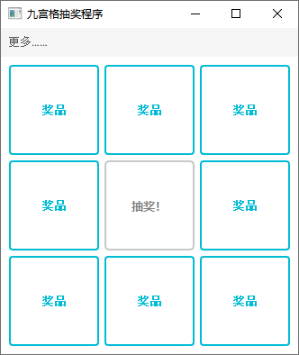
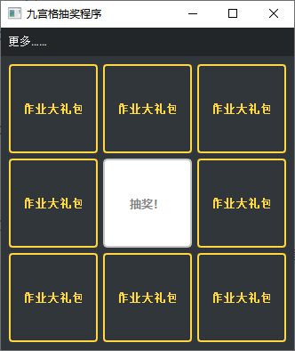
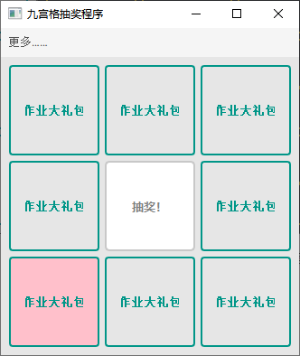

# Nine-Box-Draw

## 使用方法

 一个基于python的九宫格抽奖程序。

单击中间的“抽奖”按钮可以直接开始抽奖；

单击旁边几个奖品按钮可以修改奖品文字；

在菜单”更多“中可以批量设置奖品文字，设置窗口外观，以及查看关于作者、程序的更多详细信息。

## 待实现功能

以后**可能**会添加设置奖品背景图片的功能。如果有什么其他可以再增强或者改善的功能，欢迎提交Github的**Issue**。

## Bug

目前没有明显的问题。如果遇到的话，请通过jasoncoder@qq.com联系我，并尽可能清楚地说明您的问题，并配上屏幕截图。
